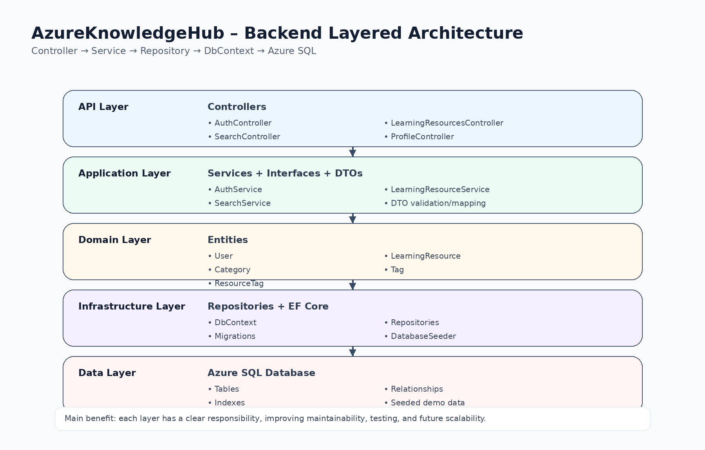
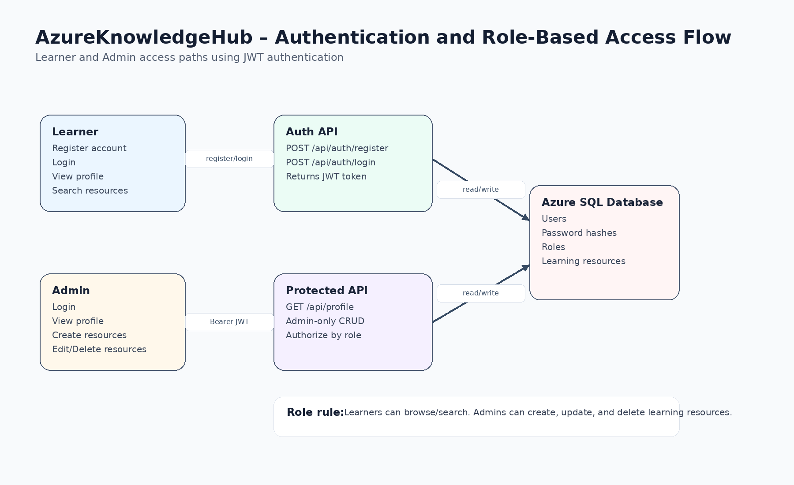
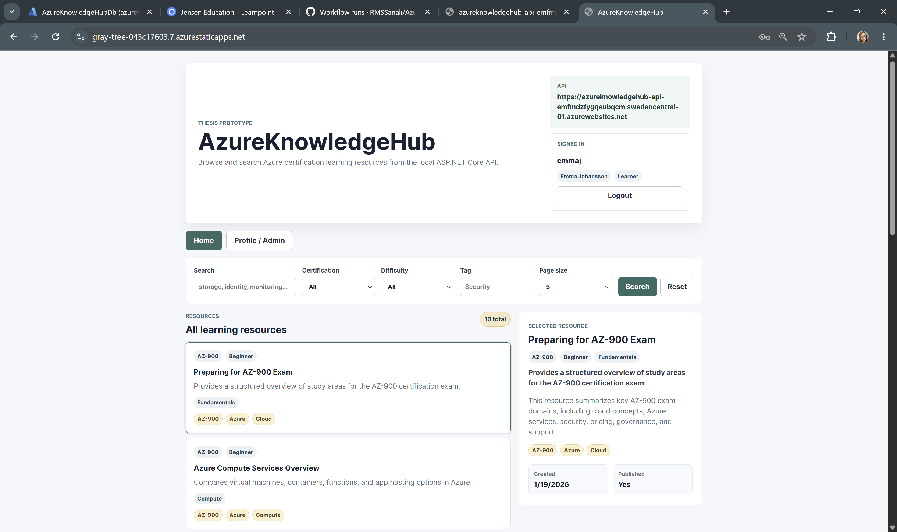
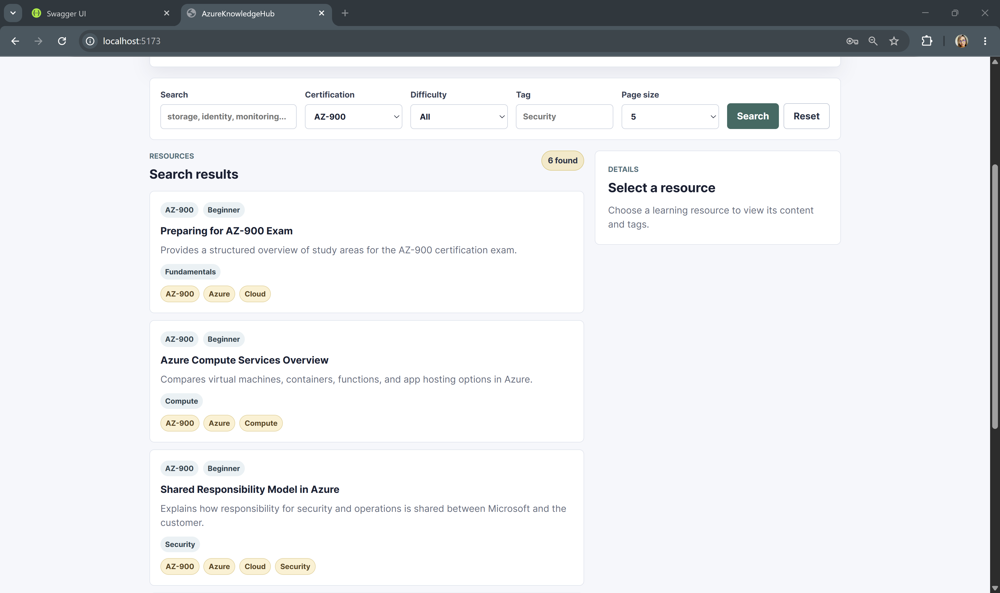
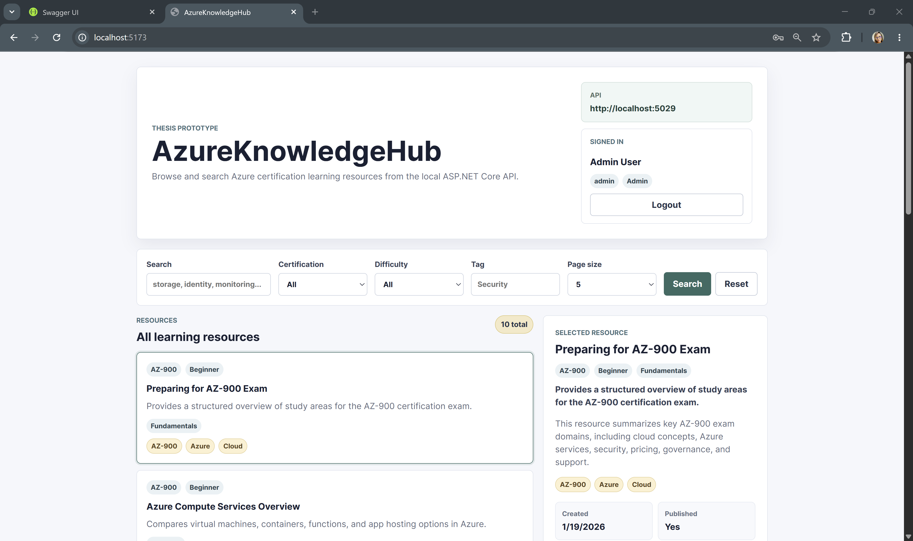
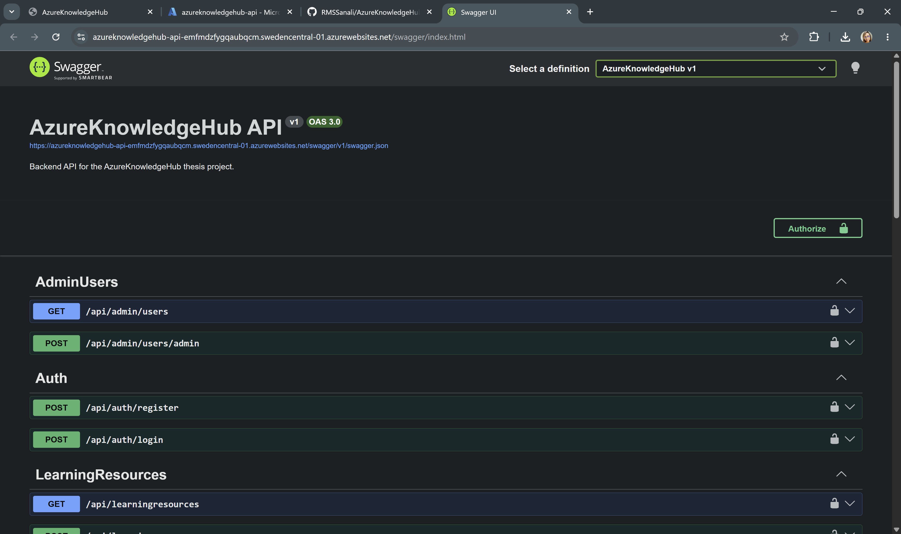
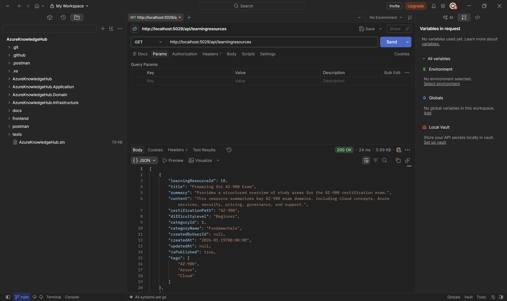
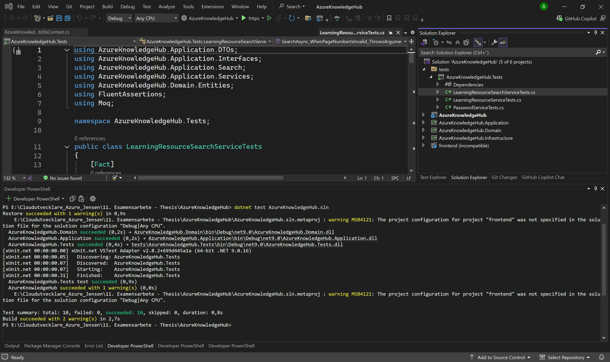
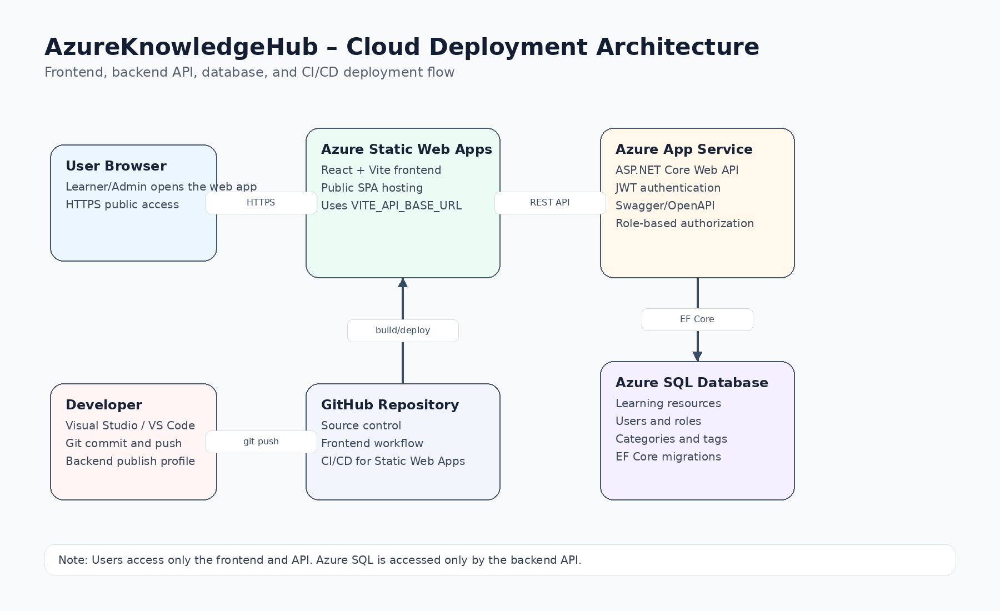
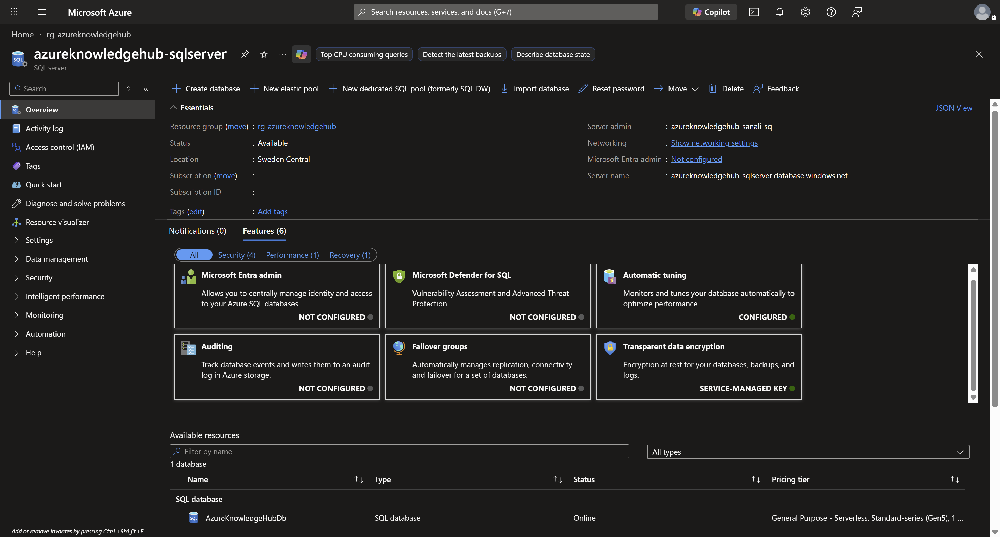

# AzureKnowledgeHub

AzureKnowledgeHub is a full-stack learning-resource platform for Azure certification study. It was developed as a degree thesis in the Cloud Developer Azure programme at JENSEN YH.

The project demonstrates how a React frontend, an ASP.NET Core Web API, Entity Framework Core, and Azure services can be combined into a maintainable cloud-based application.

## Features

- Learner registration and login
- JWT-based authentication
- Role-based access for Learners and Administrators
- Browse learning resources
- Search and filter by keyword, certification path, difficulty, category, and tag
- View detailed learning-resource content
- View and update a user profile
- Admin-only resource creation, editing, and deletion
- Admin user-management endpoint
- Swagger/OpenAPI documentation
- Azure SQL persistence through Entity Framework Core
- Database migrations and demo data seeding
- Unit tests for password, resource, and search services

## Architecture

The backend uses a layered, Clean-Architecture-inspired structure:

```text
API/Controllers
        ↓
Application/Services, Interfaces, DTOs
        ↓
Domain/Entities
        ↓
Infrastructure/Repositories, EF Core, DatabaseSeeder
        ↓
Azure SQL Database
```

The frontend and backend are separate applications. The React client communicates with the ASP.NET Core API over HTTP, while only the backend API accesses the database.





## Technology Stack

### Backend

- C#
- ASP.NET Core Web API (.NET 9)
- Entity Framework Core
- SQL Server and Azure SQL Database
- JWT Bearer authentication
- Swagger/OpenAPI

### Frontend

- React
- Vite
- JavaScript
- CSS

### Testing and QA

- xUnit
- Moq
- FluentAssertions
- Swagger/OpenAPI
- Postman

### Delivery and deployment

- GitHub Actions
- Azure App Service
- Azure Static Web Apps

## Screenshots

### Frontend



### Search and filtering



### Administrator interface



### API documentation with Swagger



### API testing with Postman



### Unit tests



## Azure Deployment

During the thesis project, the application was deployed using:

- Azure Static Web Apps for the React frontend
- Azure App Service for the ASP.NET Core API
- Azure SQL Database for persistent storage
- GitHub Actions for frontend CI/CD





The original school Azure environment is no longer accessible. The screenshots document the thesis deployment, while a new Azure subscription and configuration are required for a new deployment.

## Local Setup

### Requirements

- .NET 9 SDK
- Node.js and npm
- SQL Server LocalDB or SQL Server
- Visual Studio 2022 or another .NET-compatible IDE

### Configure the backend

The development configuration uses SQL Server LocalDB by default. Configure local secrets outside source control:

```powershell
cd AzureKnowledgeHub
dotnet user-secrets init
dotnet user-secrets set "JwtSettings:SecretKey" "replace-with-a-long-local-development-secret"
dotnet user-secrets set "SeedAdmin:Enabled" "false"
```

Demo administrator seeding is disabled by default. If it is explicitly required for local testing, configure a local-only password:

```powershell
dotnet user-secrets set "SeedAdmin:Enabled" "true"
dotnet user-secrets set "SeedAdmin:Password" "replace-with-a-local-demo-password"
```

Never commit these values to GitHub.

### Start the API

From the repository root:

```powershell
dotnet run --project .\AzureKnowledgeHub\AzureKnowledgeHub.csproj --launch-profile http
```

The API is available at:

```text
http://localhost:5029
```

Swagger is available at:

```text
http://localhost:5029/swagger
```

### Start the frontend

In a second terminal:

```powershell
cd frontend\azureknowledgehub-frontend
npm install
npm run dev
```

The frontend uses `VITE_API_BASE_URL` when configured. See `.env.example` for the local development example.

## API Endpoints

### Authentication

```text
POST /api/auth/register
POST /api/auth/login
```

### Learning resources

```text
GET    /api/learningresources
GET    /api/learningresources/{id}
POST   /api/learningresources       # Admin only
PUT    /api/learningresources/{id}  # Admin only
DELETE /api/learningresources/{id}  # Admin only
```

### Search

```text
GET /api/search/resources
```

### Profile and administration

```text
GET  /api/profile
PUT  /api/profile
GET  /api/admin/users              # Admin only
POST /api/admin/users/admin        # Admin only
```

## Testing and QA

The project includes unit tests focused on service-layer behavior, validation, password hashing, learning-resource operations, and search filtering.

Run the tests from the repository root:

```powershell
dotnet test
```

The API was also manually tested with Swagger UI and Postman. Test activities included:

- Authentication requests
- Learning-resource retrieval
- Search and filtering
- Protected admin endpoints
- HTTP status-code validation
- JSON response validation

## Security Notes

- Secrets and connection strings must be provided through local user secrets or deployment configuration.
- Demo administrator seeding is disabled by default.
- JWT signing keys must not be committed to source control.
- Publish profiles and Azure deployment metadata should remain private.
- JWT tokens are stored in browser `localStorage` in this prototype; a production version could use more restrictive cookie-based session handling.

## Known Limitations and Future Improvements

- Search currently uses EF Core `LIKE` queries.
- Search does not yet provide semantic matching, ranking, or spell correction.
- Test coverage focuses mainly on the service layer.
- Controller and end-to-end test coverage could be expanded.
- Application Insights could improve production observability.
- Azure Key Vault could provide centralized secret management.
- Azure AI Search or vector search could improve large-scale and semantic search.
- Infrastructure as Code could make Azure deployment reproducible.

## Academic Context

This application was developed and evaluated as a degree thesis. The thesis investigated cloud architecture, search functionality, scalability, maintainability, authentication, testing, and Azure deployment.

The project received the grade **Väl Godkänt (VG)**.

## Author

Created by [RMSSanali](https://github.com/RMSSanali).

## License

This project was created for educational and portfolio purposes.
